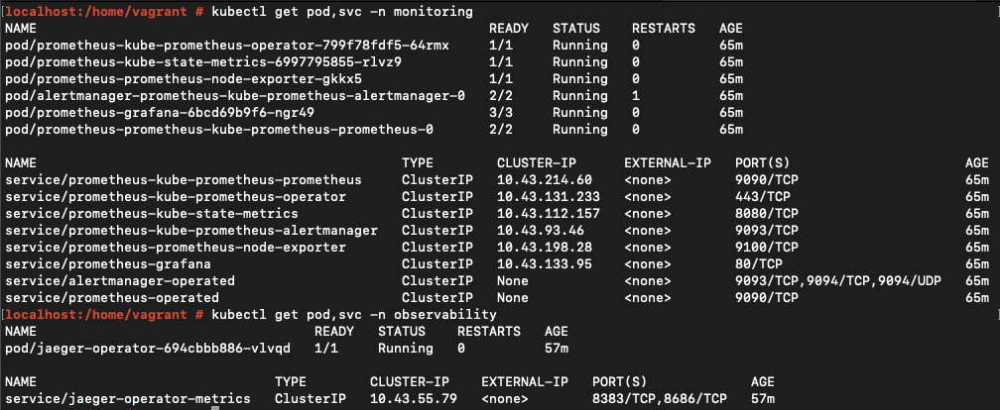
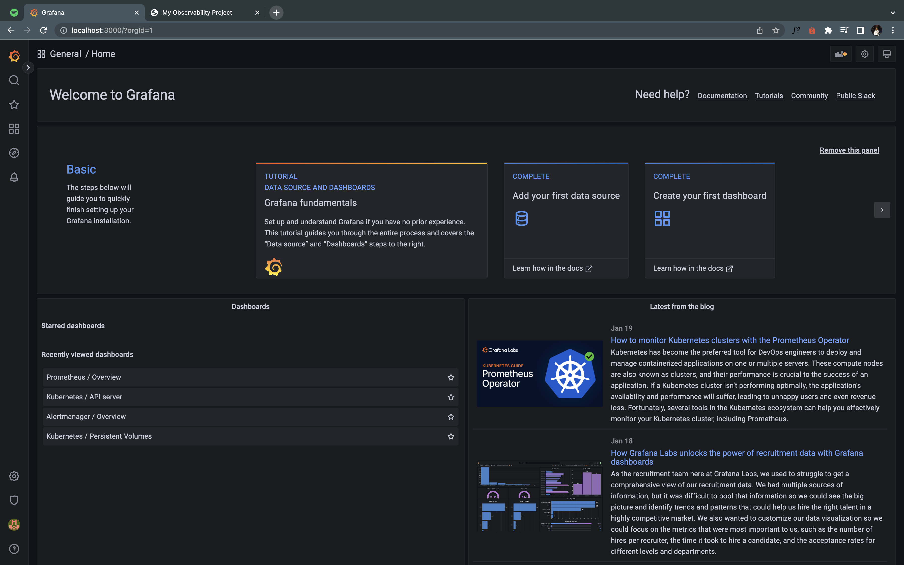
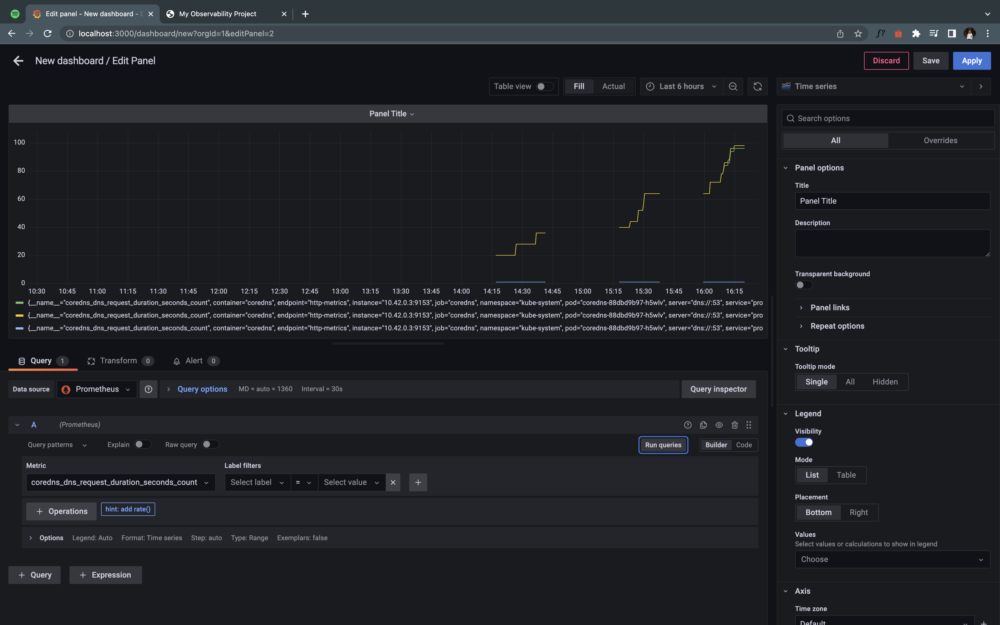
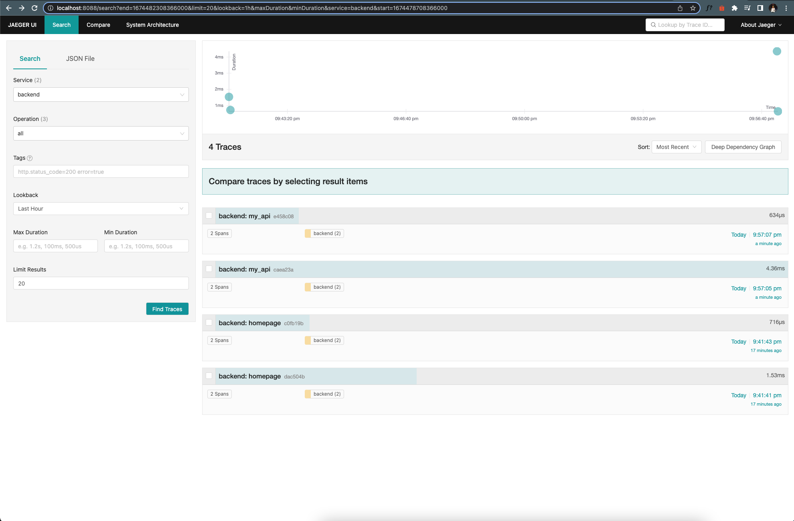
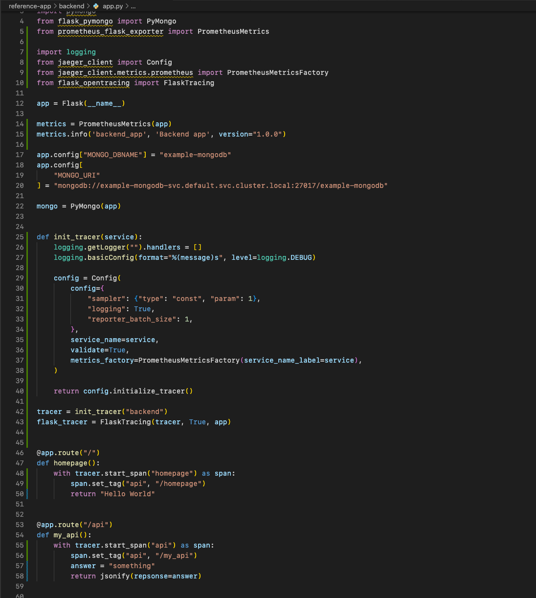
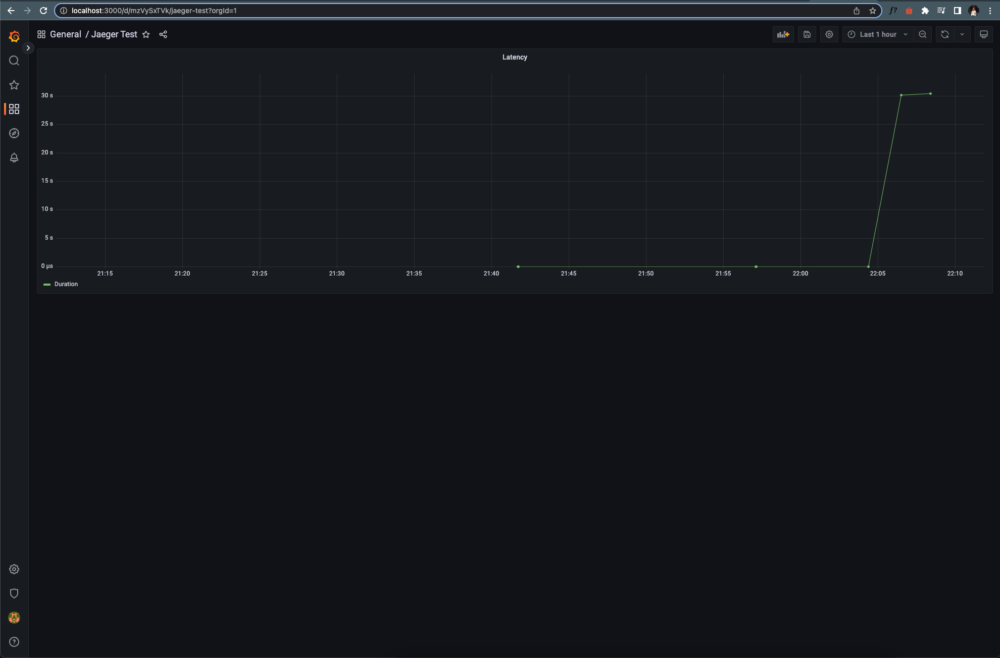
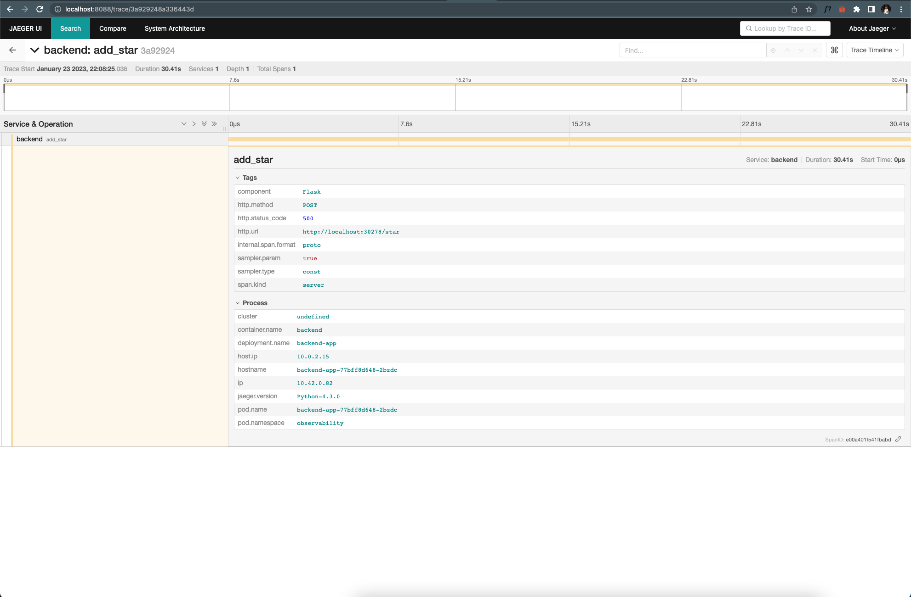

**Note:** For the screenshots, you can store all of your answer images in the `answer-img` directory.

## Verify the monitoring installation

*TODO:* run `kubectl` command to show the running pods and services for all components. Take a screenshot of the output and include it here to verify the installation

## Setup the Jaeger and Prometheus source
*TODO:* Expose Grafana to the internet and then setup Prometheus as a data source. Provide a screenshot of the home page after logging into Grafana.

## Create a Basic Dashboard
*TODO:* Create a dashboard in Grafana that shows Prometheus as a source. Take a screenshot and include it here.

## Describe SLO/SLI
*TODO:* Describe, in your own words, what the SLIs are, based on an SLO of *monthly uptime* and *request response time*.

- SLIs (Service Level Indicators) are measurements to know whether we have met our SLOs (Service Level Objectives) during a period of time. 
- The SLO of `99.95%` monthly uptime meaning that our service needs to be available for at least `99.95%` of the time in a month.
- The SLO of 99% of requests response time is `100ms`. Meaning that our service's response time should always be less than or equal to `100ms`.

## Creating SLI metrics.
*TODO:* It is important to know why we want to measure certain metrics for our customer. Describe in detail 5 metrics to measure these SLIs. 

1. Error Rate - The total number of error responses divided by the total number of requests over a period of time. (`0.01%` Error rate per minute).
2. Uptime - The duration of a service that can serve requests. (`99.95%` service availability)
3. Latency - The time taken to serve a request. (`100ms` response time)
4. Traffic - The number of requests that a service can serve over a period of time. (`1K` requests per second)
5. Saturation - Memory and CPU usage.

## Create a Dashboard to measure our SLIs
*TODO:* Create a dashboard to measure the uptime of the frontend and backend services We will also want to measure to measure 40x and 50x errors. Create a dashboard that show these values over a 24 hour period and take a screenshot.

## Tracing our Flask App
*TODO:*  We will create a Jaeger span to measure the processes on the backend. Once you fill in the span, provide a screenshot of it here. Also provide a (screenshot) sample Python file containing a trace and span code used to perform Jaeger traces on the backend service.

## Jaeger in Dashboards
*TODO:* Now that the trace is running, let's add the metric to our current Grafana dashboard. Once this is completed, provide a screenshot of it here.

## Report Error
*TODO:* Using the template below, write a trouble ticket for the developers, to explain the errors that you are seeing (400, 500, latency) and to let them know the file that is causing the issue also include a screenshot of the tracer span to demonstrate how we can user a tracer to locate errors easily.

TROUBLE TICKET

Name: Toe Pyae Sone Oo

Date: Jan 23, 2023

Subject: Backend service API (`/star`) returns `500` response code.

Affected Area:
- Endpoint: `/star`
- Method: POST

Severity: `High`

Description: 
- The service cannot connect to the Mongo database.
- Trace URL: http://localhost:8088/trace/3a929248a336443d?uiFind=e00a401f541fbabd

## Creating SLIs and SLOs
*TODO:* We want to create an SLO guaranteeing that our application has a 99.95% uptime per month. Name four SLIs that you would use to measure the success of this SLO.

1. Error rate: application returns error due to internal server error.
2. Uptime: application is available for processing user requests.
3. Latency: response time is less than the timeout set.
4. Traffic: user requests per second.

## Building KPIs for our plan
*TODO*: Now that we have our SLIs and SLOs, create a list of 2-3 KPIs to accurately measure these metrics as well as a description of why those KPIs were chosen. We will make a dashboard for this, but first write them down here.

1. Error rate
    - The error rate is less `0.05%`.
    - This KPI indicates that users are receiving successful responses.
2. Uptime
    - The service uptime is at least `99.95%`
    - This KPI indicates that service is available for user requests.
3. Latency
    - The response time is less than `1 second`.
    - This KPI indicates that user requests were not timed out.
4. Saturation
    - CPU and memory usage is less than `75%`.
    - This KPI indicates that our service is healthy for the period of time.

## Final Dashboard
*TODO*: Create a Dashboard containing graphs that capture all the metrics of your KPIs and adequately representing your SLIs and SLOs. Include a screenshot of the dashboard here, and write a text description of what graphs are represented in the dashboard.  
